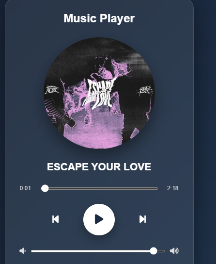
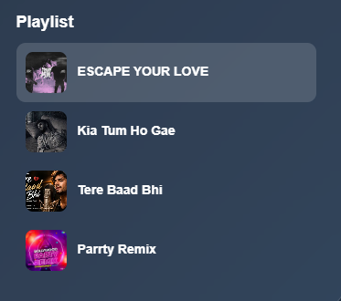

# Music Player

A modern and responsive Music Player developed using HTML, CSS, and JavaScript as part of my Frontend Development Internship project.

##  About The Project

This project is a web-based Music Player designed with a clean and user-friendly interface. It provides essential music playback controls and a playlist system using JavaScript.

The project was developed to demonstrate practical frontend development skills, including HTML structure, CSS styling, and JavaScript-based audio control.

##  Features

 ▶️ Play and Pause music
 ⏮ Previous song
 ⏭ Next song
🎵 Song title display
 👤 Artist name display
 ⏱ Song duration
 📊 Interactive progress bar
 🔊 Volume control
 📋 Playlist
 ▶️ Autoplay next song

##  Technologies Used

* HTML5
* CSS
* JavaScript
* Font Awesome

##  Project Structure

```text
Music-Player/
│
├── index.html
├── style.css
├── script.js
├── README.md
│
├── music/
│   ├── song1.mp3
│   ├── song2.mp3
│   ├── song3.mp3
│   └── song4.mp3
│
├── images/
│   ├── cover1.jpg
│   ├── cover2.jpg
│   ├── cover3.jpg
│   └── cover4.jpg
│
└── screenshots/
```

## Screenshots

### Music Player



### Playlist



##  How To Run

1. Download or clone this repository.
2. Open the project folder in Visual Studio Code.
3. Make sure the music files are inside the `music` folder.
4. Open `index.html` in a web browser.
5. Use the player controls to play, pause, change songs, adjust volume, and use the playlist.

##  Internship Project

This project was developed as part of my **Frontend Development Internship at CodeAlpha**.

The project helped me gain practical experience in building interactive web applications using HTML, CSS, and JavaScript.

## 👩 Developed By

**Aima Sadeer**

BS Software Engineering Student

Frontend Development Intern

