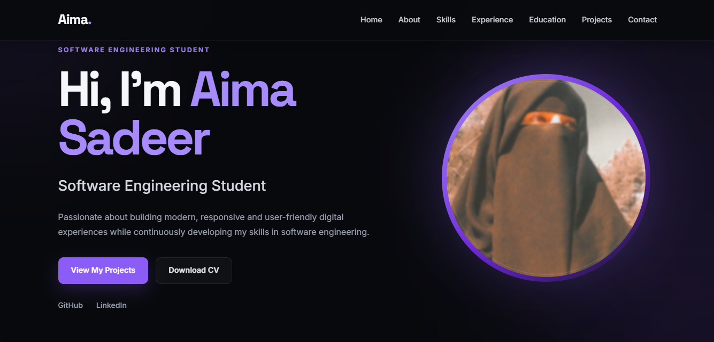
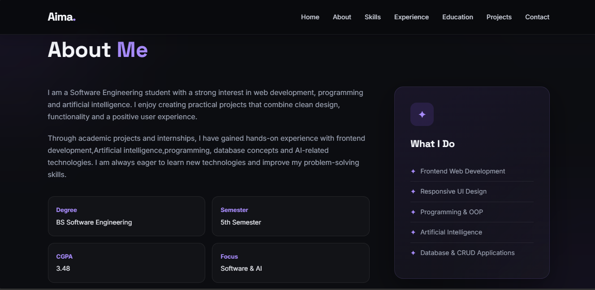
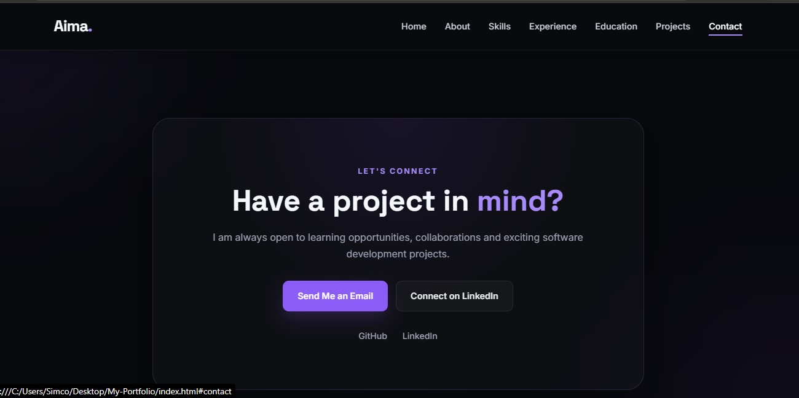

# Aima Sadeer — Personal Portfolio

A modern and responsive personal portfolio website designed and developed to showcase my skills, education, professional experience, internships, and projects as a Software Engineering student.

## Project Overview

This portfolio website provides a professional online presence where visitors can learn about my background, technical skills, academic journey, professional experience, and featured projects.

The website includes a clean dark-themed interface with responsive layouts, smooth navigation, interactive animations, and links to my GitHub and LinkedIn profiles.

## Features

* Responsive and mobile-friendly design
* Modern dark-themed user interface
* Smooth scrolling navigation
* Mobile navigation menu
* Interactive hover effects
* Scroll reveal animations
* Professional About section
* Skills and Technologies section
* Education section
* Professional Experience section
* Featured Projects section
* GitHub project links
* Live project demo link
* Downloadable CV
* Contact section
* GitHub and LinkedIn integration

## Technologies Used

* HTML5
* CSS3
* JavaScript
* Google Fonts
* Responsive Web Design

## Portfolio Sections

### Home

The Home section introduces me as a Software Engineering student and provides quick access to my projects and CV.

### About

The About section provides information about my educational background, interests, and areas of focus.

### Skills

The Skills section highlights my programming, web development, database, software engineering, tools, and artificial intelligence skills.

### Experience

The Experience section showcases my internships and professional experience, including roles in Artificial Intelligence, Frontend Development, and Digital Marketing.

### Education

The Education section presents my BS Software Engineering academic background.

### Projects

The Projects section showcases selected projects with screenshots, technologies used, and links to their GitHub repositories and live demos.

### Contact

The Contact section provides ways to connect with me through email, GitHub, and LinkedIn.

## Project Structure

```text
My-Portfolio/
│
├── index.html
├── style.css
├── script.js
│
├── assets/
│   └── Aima-Sadeer-CV.pdf
│
├── images/
│   ├── profile.jpg
│   ├── chatbot-1.jpg
│   ├── chatbot-2.jpg
│   ├── image-gallery-1.jpg
│   ├── image-gallery-2.jpg
│   ├── calculator-1.jpg
│   ├── calculator-2.jpg
│   ├── music-player-1.png
│   └── music-player-2.png
│
└── ProjectViews/
    ├── home.jpg
    ├── about.jpg
    └── contact.jpg
```

## Project Views

### Home Page



### About Page



### Contact Page



## Featured Projects

### AI Chatbot

A simple interactive chatbot project developed to provide a basic conversational experience.

**Technologies:** Python, AI

[View on GitHub](https://github.com/Aima-Sadeer/AI-Chatbot)

### Image Gallery

A responsive and interactive image gallery featuring categorized images, smooth navigation, and an engaging visual interface.

**Technologies:** HTML, CSS, JavaScript

[View on GitHub](https://github.com/Aima-Sadeer/CodeAlpha_ImageGallery)

### Calculator

A clean and functional calculator application designed to perform common mathematical operations through an intuitive interface.

**Technologies:** HTML, CSS, JavaScript

[View on GitHub](https://github.com/Aima-Sadeer/CodeAlpha_Calculator)

### Music Player

A modern music player interface featuring playback controls, playlist functionality, and an interactive user experience.

**Technologies:** HTML, CSS, JavaScript

[View on GitHub](https://github.com/Aima-Sadeer/Music-Player)

## Professional Experience

* Artificial Intelligence Intern — Decodelabs
* Frontend Developer Intern — CodeAlpha
* Digital Marketing Professional — EAVENX
* Digital Marketing Intern — EAVENX
* Intern — ISPR

## Connect With Me

**GitHub:**

https://github.com/Aima-Sadeer

**LinkedIn:**

https://www.linkedin.com/in/aima-khan-685179382

**Email:**

[aimakhan2101@gmail.com](mailto:aimakhan2101@gmail.com)

## Author

**Aima Sadeer**

BS Software Engineering Student

---

⭐ If you find this portfolio project interesting, feel free to explore the repository and my other projects.
